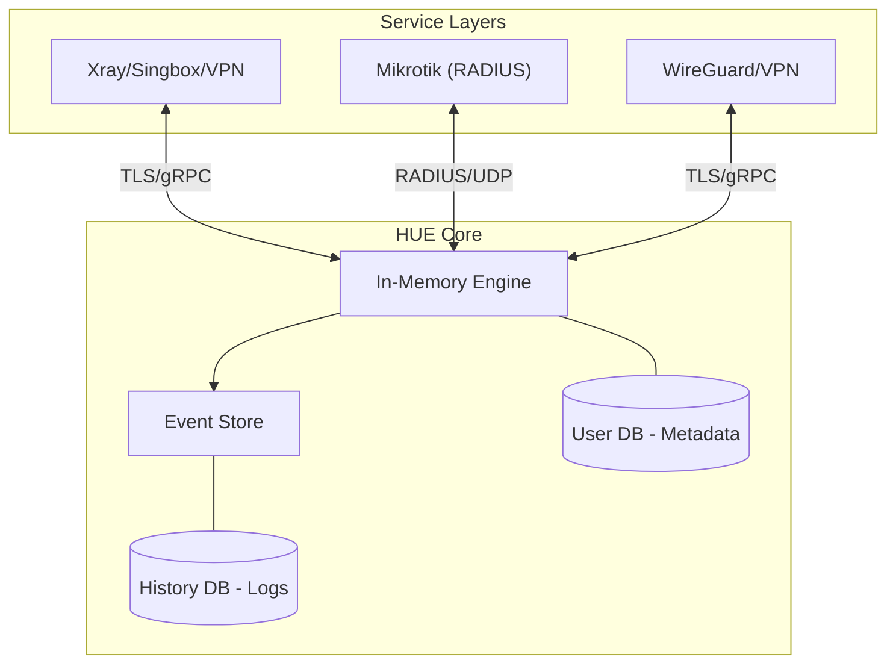

# 🚀 Hiddify Usage Engine (HUE) - Go

**A universal, protocol-agnostic Usage & Subscription Control Plane.**

HUE is a high-performance, secure, and ultra-lightweight engine designed to manage user consumption across a vast array of protocols. It is engineered for extremely low I/O and CPU overhead, making it ideal for managing 1000+ users on standard hardware.

---

## ✨ Key Features

- **🌐 Comprehensive Protocol Support**: 
  - **VPN/Proxy**: Xray, Singbox, WireGuard, OpenVPN, IPSec, SSH.
  - **Core Protocols**: Vless, Trojan, Shadowsocks, VMess.
  - **Enterprise**: PPP, L2TP, and RADIUS (Mikrotik/NAS) support.
- **⚡ Performance Optimized**: 
  - **Buffered Writes**: Aggregates usage in-memory to minimize disk I/O.
  - **Dual-DB Architecture**: Separate databases for Metadata and Historical Logs to maintain constant speed.
- **📜 Event Sourcing Architecture**: Immutable event logs for perfect consistency and audit replay.
- **🔒 Privacy First**: Zero Raw-IP retention. IPs are deleted immediately after session/geo processing.
- **🛡️ Fine-Grained Locking**: High concurrency with locks isolated to specific users or services.

---

## 🏗️ Architecture



---

## 🚀 Quick Start

### Prerequisites

- Go 1.22+ (for building from source)
- Protocol Buffers compiler (`protoc`) - optional, for regenerating proto files
- SQLite 3

### Build from Source

```bash
# Clone the repository
git clone https://github.com/hiddify/hue-go.git
cd hue-go

# Install dependencies
go mod tidy

# Build in release mode
make build

# The binary will be at bin/hue
```

### Using Docker

```bash
# Build the image
docker build -t hue -f deployments/docker/Dockerfile .

# Run with environment variables
docker run -d \
  -p 50051:50051 \
  -p 50052:50052 \
  -e HUE_AUTH_SECRET=your-secret-key \
  -v hue-data:/data \
  --name hue \
  hue
```

Or use docker-compose:

```bash
# Run with docker-compose
docker-compose -f deployments/docker/docker-compose.yml up -d
```

### Configuration

HUE is configured entirely through environment variables. See `config.env.example` for all options.

| Variable | Description | Default |
|----------|-------------|---------|
| `HUE_DB_URL` | Database connection string | `sqlite://./hue.db` |
| `HUE_PORT` | gRPC server port | `50051` |
| `HUE_AUTH_SECRET` | Master authentication secret | Required |
| `HUE_LOG_LEVEL` | Logging verbosity | `info` |
| `HUE_DB_FLUSH_INTERVAL` | Batch write interval | `5m` |
| `HUE_CONCURRENT_WINDOW` | Session counting window | `5m` |
| `HUE_PENALTY_DURATION` | Penalty duration | `10m` |
| `HUE_MAXMIND_DB_PATH` | Path to MaxMind GeoLite2 database | `""` |
| `HUE_EVENT_STORE_TYPE` | Event storage type (`db`, `file`, `none`) | `db` |

---

## 📡 API Reference

### gRPC Services

HUE exposes three gRPC services:

1. **UsageService** (port 50051) - Usage reporting from nodes
2. **AdminService** (port 50051) - User/package/node management
3. **NodeService** (port 50051) - Node authentication and commands

### HTTP REST API (port 50052)

| Endpoint | Method | Description |
|----------|--------|-------------|
| `/health` | GET | Health check |
| `/api/v1/users` | GET/POST | List/create users |
| `/api/v1/users/{id}` | GET/PUT/DELETE | Get/update/delete user |
| `/api/v1/packages` | POST | Create package |
| `/api/v1/nodes` | GET/POST | List/create nodes |
| `/api/v1/services` | POST | Create service |
| `/api/v1/stats` | GET | Get statistics |

All endpoints require `?secret=<HUE_AUTH_SECRET>` query parameter.

---

## 🛠️ Scalability Model

| Scale | Strategy | I/O Management |
| :--- | :--- | :--- |
| **Medium (Up to 1000+ Users)** | Multi-thread single instance + SQLite WAL | 5min Buffered Batch Flush |
| **Large (10k+ Users)** | Multi-instance + TimescaleDB | Continuous Ingest |

---

## 📁 Project Structure

```
hue-go/
├── cmd/hue/              # Main binary
├── internal/
│   ├── api/
│   │   ├── grpc/         # gRPC services
│   │   └── http/         # REST API
│   ├── auth/             # Authentication & locking
│   ├── config/           # Configuration
│   ├── domain/           # Domain models
│   ├── engine/           # Core engine (quota, session, penalty, geo)
│   ├── eventstore/       # Event sourcing
│   └── storage/
│       ├── cache/        # In-memory cache
│       └── sqlite/       # SQLite database layer
├── pkg/proto/            # Protocol buffer definitions
├── deployments/
│   ├── docker/           # Docker files
│   └── k8s/              # Kubernetes manifests
├── go.mod
├── Makefile
└── README.md
```

---

## 🗺️ Roadmap

- [x] Core gRPC Ingestor & Quota Engine
- [x] SQLite database with WAL mode
- [x] Buffered write system
- [x] Concurrent session enforcement
- [x] Event sourcing
- [x] HTTP REST API
- [ ] Xray, Singbox, & WireGuard Adapters
- [ ] Advanced Traffic Tagging
- [ ] **RADIUS / NAS Support (Final Phase Priority)**

---

## 📄 License

HUE is released under the [MIT License](LICENSE). 

---
<p align="center">
  Made with ❤️ by the Hiddify Team
</p>
