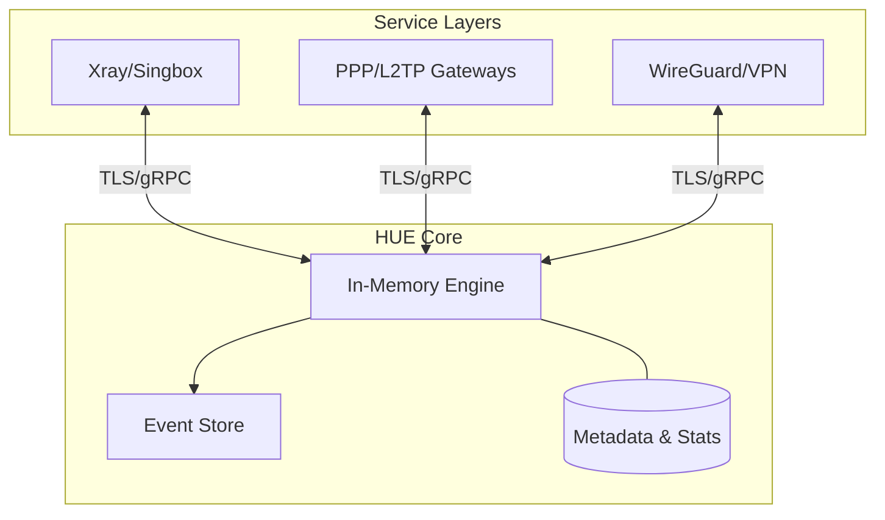

# 🚀 Hiddify Usage Engine (HUE)

**A universal, protocol-agnostic Usage & Subscription Control Plane.**

HUE is a high-performance, secure, and ultra-lightweight engine designed to manage user consumption across multiple nodes and a vast array of protocols. It is engineered for low overhead, making it ideal for everything from small personal servers to large-scale ISP-grade deployments.

---

## ✨ Key Features

- **🌐 Massive Protocol Support**: Native integration for:
  - **VPN/Tunneling**: Xray, Singbox, WireGuard, OpenVPN, IPSec, SSH.
  - **Traditional**: PPP, PPTP, SSTP, L2TP.
  - **Modern Proxies**: Vless, Trojan, Shadowsocks, VMess.
- **⚡ Ultra-Low Overhead**: optimized for minimal CPU and RAM usage. Runs smoothly with 100+ users on low-spec hardware.
- **📜 Event Sourcing Architecture**: Every state change (Connect, Disconnect, Usage, Reset) is an immutable event, ensuring perfect consistency and auditability.
- **🔒 Privacy First**: Zero Raw-IP retention. Transient IPs are used for session counting and Geo-extraction, then immediately purged.
- **🛠️ ENV-Powered Configuration**: Fully configurable via Environment Variables for modern, cloud-native deployments.
- **📊 Optimized Storage**: Intelligent separation of active usage counters and historical analytics for maximum performance.
- **🛡️ Fine-Grained Locking**: System-wide performance remains fluid because locking is localized to the specific modified item (user/node/service).

---

## 🏗️ Architecture

---

## 🛠️ Performance Model

| Scale | Storage Mechanism | Setup Overhead |
| :--- | :--- | :--- |
| **Small (<200 Users)** | Multi-thread single instance + SQLite/File | Minimal (Low RAM) |
| **Large (10k+ Users)** | Multi-instance + TimescaleDB  |

---

## 📄 License

HUE is released under the [MIT License](LICENSE). 

---

  Made with ❤️ by the Hiddify Team

