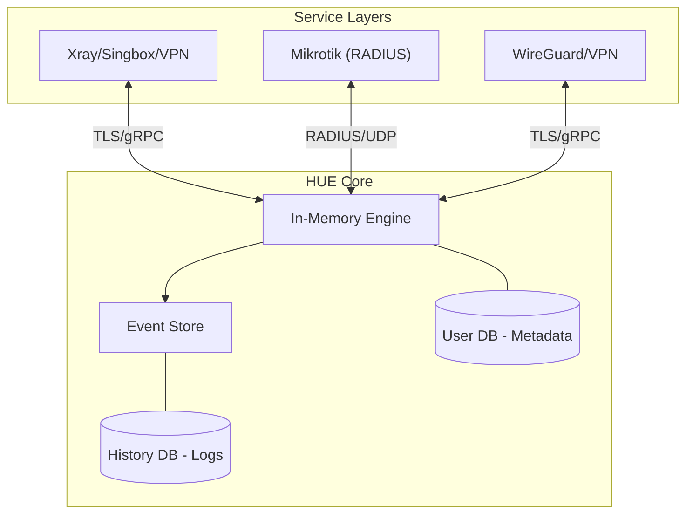

# 🚀 Hiddify Usage Engine (HUE)

**A universal, protocol-agnostic Usage & Subscription Control Plane.**

HUE is a high-performance, secure, and ultra-lightweight engine designed to manage user consumption across a vast array of protocols. It is engineered for extremely low I/O and CPU overhead, making it ideal for managing 1000+ users on standard hardware.

---

## ✨ Key Features

- **🌐 Comprehensive Protocol Support**: 
  - **VPN/Proxy**: Xray, Singbox, WireGuard, OpenVPN, IPSec, SSH.
  - **Core Protocols**: Vless, Trojan, Shadowsocks, VMess.
  - **Enterprise**: PPP, L2TP, and RADIUS (Mikrotik/NAS) support.
- **⚡ Performance Optimized**: 
  - **Buffered Writes**: Aggregates usage in-memory to minimize disk I/O.
  - **Dual-DB Architecture**: Separate databases for Metadata and Historical Logs to maintain constant speed.
- **📜 Event Sourcing Architecture**: Immutable event logs for perfect consistency and audit replay.
- **🔒 Privacy First**: Zero Raw-IP retention. IPs are deleted immediately after session/geo processing.
- **🛡️ Fine-Grained Locking**: High concurrency with locks isolated to specific users or services.

---

## 🏗️ Architecture

---

## 🛠️ Scalability Model

| Scale | Strategy | I/O Management |
| :--- | :--- | :--- |
| **Medium (Up to 1000+ Users)** | Multi-thread single instance + SQLite WAL | 5min Buffered Batch Flush |
| **Large (10k+ Users)** | Multi-instance + TimescaleDB | Continuous Ingest |

---

## 🗺️ Roadmap

- [ ] Core gRPC Ingestor & Quota Engine
- [ ] Xray, Singbox, & WireGuard Adapters
- [ ] Advanced Traffic Tagging
- [ ] **RADIUS / NAS Support (Final Phase Priority)**

---

## 📄 License

HUE is released under the [MIT License](LICENSE). 

---

  Made with ❤️ by the Hiddify Team

